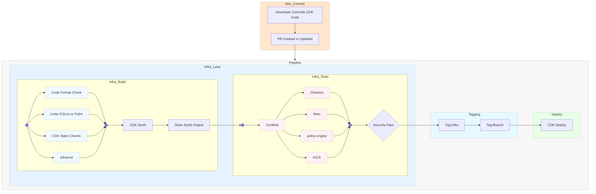

# AWS CDK Infrastructure Pipeline — Description

The AWS CDK infrastructure pipeline ensures that Infrastructure-as-Code (IaC) is **consistent, secure, and compliant** before deployment.  
It follows a structured path from code commit to deployment, integrating **linting, security scanning, and policy enforcement tools**.  

Some tools are **optional** and can be added based on organizational needs, security posture, or compliance requirements.

---

## 1. Linting Stage (Code Quality and Best Practices)
Ensures CDK application code is **formatted, syntactically correct, and follows best practices** before synthesis.

### TypeScript
- **ESLint** *(Recommended)*  
  JavaScript/TypeScript linter enforcing style and coding standards.  
  **Problem solved:** Ensures code quality and prevents common bugs.
- **Prettier** *(Optional)*  
  Code formatter for consistent styling.  
  **Problem solved:** Standardizes formatting across teams.

### Python
- **flake8** *(Recommended)*  
  Python linter enforcing style and syntax rules.  
  **Problem solved:** Prevents common style and formatting issues.
- **pylint** *(Recommended)*  
  Static analysis for Python detecting code errors and enforcing standards.  
  **Problem solved:** Identifies potential bugs early in development.
- **black** *(Optional)*  
  Python code formatter.  
  **Problem solved:** Enforces consistent formatting automatically.

### Java
- **Checkstyle** *(Recommended)*  
  Style and convention checker for Java code.  
  **Problem solved:** Maintains consistency across large Java projects.
- **SpotBugs** *(Recommended)*  
  Static analysis tool for Java detecting potential bugs.  
  **Problem solved:** Identifies runtime issues before deployment.

### C# / .NET
- **StyleCop** *(Recommended)*  
  Enforces C# style and consistency rules.  
  **Problem solved:** Standardizes code style across teams.
- **FxCopAnalyzers** *(Optional)*  
  Static analysis for C# detecting code issues and security concerns.  
  **Problem solved:** Flags potential bugs and vulnerabilities.

### Go
- **golangci-lint** *(Recommended)*  
  Multi-linter for Go projects combining popular linting tools.  
  **Problem solved:** Detects issues ranging from formatting to potential bugs.

---

## 2. Synth & Store Stage
Generates and stores CloudFormation templates for review and deployment.

- **Synth CloudFormation Templates** *(Baseline — Required)*  
  Converts CDK constructs into CloudFormation templates.  
  **Problem solved:** Creates a deployable infrastructure definition from source code.

- **Store Synth Templates in Repo** *(Recommended for Compliance)*  
  Saves the synthesized templates in a version-controlled repository.  
  **Problem solved:** Maintains an audit trail of infrastructure configurations.

---

## 3. Security & Policy Stage (Enforcing Security Standards)
Validates that synthesized CloudFormation templates comply with **security policies, compliance frameworks, and best practices**.

- **OPA (Open Policy Agent) via Conftest** *(Recommended)*  
  Policy-as-code engine enforcing custom security rules and compliance standards.  
  **Problem solved:** Enforces organizational security and compliance rules.

- **Checkov** *(Recommended)*  
  Scans CloudFormation templates for security misconfigurations.  
  **Problem solved:** Identifies common vulnerabilities like open ports or unencrypted resources.

- **cdk-nag** *(Recommended)*  
  AWS CDK-specific compliance and best practices checker.  
  **Problem solved:** Ensures CDK stacks follow AWS security and compliance guidelines.

---

## 4. Deployment Stage
Deploys approved CDK stacks to target environments.

- **CDK Deploy** *(Baseline — Required)*  
  Deploys synthesized CloudFormation stacks.  
  **Problem solved:** Provisions infrastructure in a controlled, validated manner.

---

## Summary
- **Baseline tools** (language linters, Synth, OPA, Checkov, cdk-nag, CDK Deploy) are recommended for **all environments**.  
- **Optional tools** (Prettier, black, FxCopAnalyzers) enhance formatting, maintainability, or compliance in **mature or regulated environments**.  
- This pipeline ensures **code quality, compliance, and security** from development to deployment.

# Diagram

