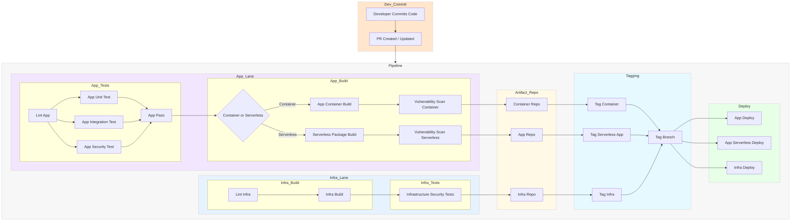

```mermaid
flowchart TD
 
    %% ====================
    %% Developer Commit & PR Stage
    %% ====================
    subgraph Dev_Commit
      DC1[Developer Commits Code]
      DC2[PR Created / Updated]
      DC1 --> DC2
    end
    
    DC2 --> Pipeline
    subgraph Pipeline
    %% ====================
    %% App Lane
    %% ====================
    subgraph App_Lane
      direction LR
      subgraph App_Tests
        AT1[Lint App] --> AT2[App Unit Test]
        AT1 --> AT3[App Integration Test]
        AT1 --> AT4[App Security Test]
        AT2 --> AT5[App Pass]
        AT3 --> AT5
        AT4 --> AT5
      end
      
      %% App Build
      subgraph App_Build
        AT5 --> AB1{Container or Serverless}
        AB1 -->|Container| AB2[App Container Build]
        AB2 --> AB3[Vulnerability Scan Container]
        
        AB1 -->|Serverless| AB4[Serverless Package Build]
        AB4 --> AB5[Vulnerability Scan Serverless]
      end
    end
    
    %% ====================
    %% Infra Lane
    %% ====================
    subgraph Infra_Lane
      direction LR
      subgraph Infra_Build
        IB1[Lint Infra] --> IB2[Infra Build]
      end
      subgraph Infra_Tests
        IB2 --> IT1[Infrastructure Security Tests]
      end
    end
    
    %% ====================
    %% Shared Artifact Repo
    %% ====================
    subgraph Artifact_Repo
      AR1[Container Repo]
      AR2[App Repo]
      AR3[Infra Repo]
      
      AB3 --> AR1
      AB5 --> AR2
      IT1 --> AR3
    end
    
    %% ====================
    %% Tagging
    %% ====================
    subgraph Tagging
      AR1 --> TG1[Tag Container]
      AR2 --> TG2[Tag Serverless App]
      AR3 --> TG3[Tag Infra]
      TG1 --> TG4[Tag Branch]
      TG2 --> TG4
      TG3 --> TG4
    end
    
    %% ====================
    %% Deploy
    %% ====================
    subgraph Deploy
      TG4 --> DP1[App Deploy]
      TG4 --> DP2[App Serverless Deploy]
      TG4 --> DP3[Infra Deploy]
    end
      end

    %% Softer pastel fills & consistent stroke
    style Dev_Commit fill:#ffe6cc,stroke:#cccccc,stroke-width:1px
    style Pipeline fill:#f7f7f7,stroke:#cccccc,stroke-width:1px
    style App_Lane fill:#f2e6ff,stroke:#cccccc,stroke-width:1px
    style Infra_Lane fill:#e6f2ff,stroke:#cccccc,stroke-width:1px
    style Artifact_Repo fill:#fff9e6,stroke:#cccccc,stroke-width:1px
    style Tagging fill:#e6f9ff,stroke:#cccccc,stroke-width:1px
    style Deploy fill:#e6ffe6,stroke:#cccccc,stroke-width:1px

```
