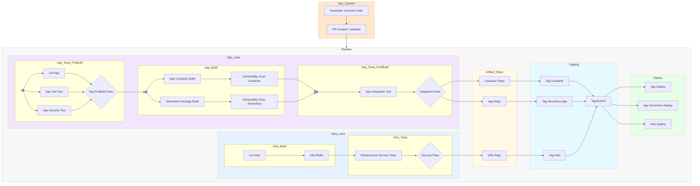

```mermaid
flowchart TD

%% ====================
%% Developer Commit & PR Stage
%% ====================
subgraph Dev_Commit
  DC1[Developer Commits Code]
  DC2[PR Created / Updated]
  DC1 --> DC2
end

%% ====================
%% Pipeline
%% ====================
DC2 --> Pipeline
subgraph Pipeline

  %% ====================
  %% App Lane
  %% ====================
  subgraph App_Lane
    direction LR
    
    %% Pre-Build Tests (parallel with junction)
    subgraph App_Tests_PreBuild
      ATJ@{ shape: f-circ, label: "PreBuild Junction" }
      ATJ --> AT1[Lint App]
      ATJ --> AT2[App Unit Test]
      ATJ --> AT3[App Security Test]
      AT1 --> APB{App PreBuild Pass}
      AT2 --> APB
      AT3 --> APB
    end
    
    %% Build (parallel with junction)
    subgraph App_Build
      APB --> ABJ@{ shape: f-circ, label: "Build Junction" }
      ABJ --> AB2[App Container Build]
      AB2 --> AB3[Vulnerability Scan Container]
      ABJ --> AB4[Serverless Package Build]
      AB4 --> AB5[Vulnerability Scan Serverless]
    end
    
    %% Post-Build Integration Tests (parallel with junction)
    subgraph App_Tests_PostBuild
      ITJ@{ shape: f-circ, label: "Integration Junction" }
      AB3 --> ITJ
      AB5 --> ITJ
      ITJ --> IT1[App Integration Test]
      IT1 --> ITP{Integration Pass}
    end
  end
  
  %% ====================
  %% Infra Lane
  %% ====================
  subgraph Infra_Lane
    direction LR
    subgraph Infra_Build
      IB1[Lint Infra] --> IB2[Infra Build]
    end
    subgraph Infra_Tests
      IB2 --> IT2[Infrastructure Security Tests]
      IT2 --> ISP{Security Pass}
    end
  end
  
  %% ====================
  %% Artifact Repo
  %% ====================
  subgraph Artifact_Repo
    AR1[Container Repo]
    AR2[App Repo]
    AR3[Infra Repo]
    ITP --> AR1
    ITP --> AR2
    ISP --> AR3
  end
  
  %% ====================
  %% Tagging
  %% ====================
  subgraph Tagging
    AR1 --> TG1[Tag Container]
    AR2 --> TG2[Tag Serverless App]
    AR3 --> TG3[Tag Infra]
    TG1 --> TG4[Tag Branch]
    TG2 --> TG4
    TG3 --> TG4
  end
  
  %% ====================
  %% Deploy
  %% ====================
  subgraph Deploy
    TG4 --> DP1[App Deploy]
    TG4 --> DP2[App Serverless Deploy]
    TG4 --> DP3[Infra Deploy]
  end

end

%% ====================
%% Styles
%% ====================
style Dev_Commit fill:#ffe6cc,stroke:#cccccc,stroke-width:1px
style Pipeline fill:#f7f7f7,stroke:#cccccc,stroke-width:1px
style App_Lane fill:#f2e6ff,stroke:#cccccc,stroke-width:1px
style Infra_Lane fill:#e6f2ff,stroke:#cccccc,stroke-width:1px
style Artifact_Repo fill:#fff9e6,stroke:#cccccc,stroke-width:1px
style Tagging fill:#e6f9ff,stroke:#cccccc,stroke-width:1px
style Deploy fill:#e6ffe6,stroke:#cccccc,stroke-width:1px


```
