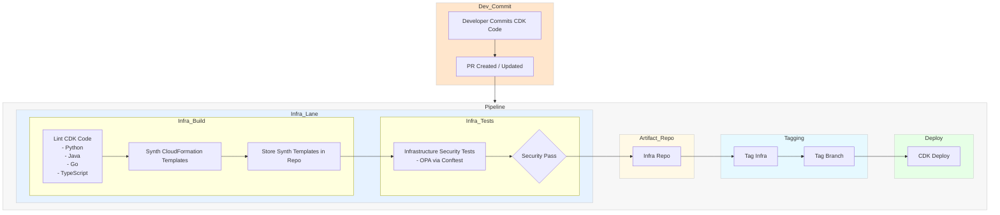

```mermaid
flowchart TD

%% ====================
%% Developer Commit & PR Stage
%% ====================
subgraph Dev_Commit
  DC1[Developer Commits CDK Code]
  DC2[PR Created / Updated]
  DC1 --> DC2
end

%% ====================
%% Pipeline (CDK Infra)
%% ====================
DC2 --> Pipeline
subgraph Pipeline

  %% ====================
  %% Infra Lane (CDK)
  %% ====================
  subgraph Infra_Lane
    direction LR
    
    %% Infra Build & Tests
    subgraph Infra_Build
      IB1[Lint CDK Code<br>- Python<br>- Java<br>- Go<br>- TypeScript] --> IB2[Synth CloudFormation Templates]
      IB2 --> SR[Store Synth Templates in Repo]
    end
    
    subgraph Infra_Tests
      SR --> IT2[Infrastructure Security Tests<br>- OPA via Conftest]
      IT2 --> ISP{Security Pass}
    end
  end
  
  %% ====================
  %% Artifact Repo
  %% ====================
  subgraph Artifact_Repo
    AR3[Infra Repo]
    ISP --> AR3
  end
  
  %% ====================
  %% Tagging
  %% ====================
  subgraph Tagging
    AR3 --> TG3[Tag Infra]
    TG3 --> TG4[Tag Branch]
  end
  
  %% ====================
  %% Deploy
  %% ====================
  subgraph Deploy
    TG4 --> DP3[CDK Deploy]
  end

end

%% ====================
%% Styles
%% ====================
style Dev_Commit fill:#ffe6cc,stroke:#cccccc,stroke-width:1px
style Pipeline fill:#f7f7f7,stroke:#cccccc,stroke-width:1px
style Infra_Lane fill:#e6f2ff,stroke:#cccccc,stroke-width:1px
style Artifact_Repo fill:#fff9e6,stroke:#cccccc,stroke-width:1px
style Tagging fill:#e6f9ff,stroke:#cccccc,stroke-width:1px
style Deploy fill:#e6ffe6,stroke:#cccccc,stroke-width:1px


```
