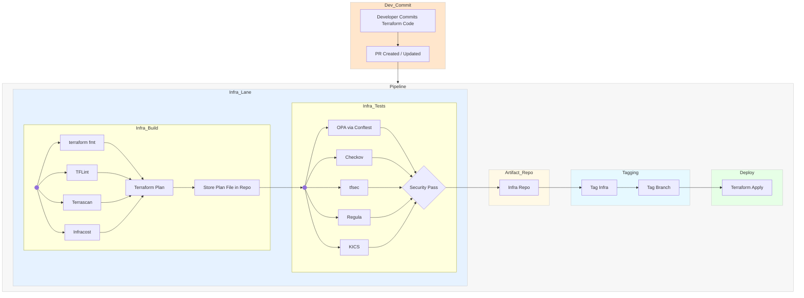

# Terraform Infrastructure Pipeline

The Terraform infrastructure pipeline ensures that Infrastructure-as-Code (IaC) is **consistent, secure, and compliant** before deployment.  
It follows a structured path from code commit to deployment, integrating **linting, security scanning, and policy enforcement tools**.  

Some tools are **optional** and can be added based on organizational needs, security posture, or compliance requirements.

---

## 1. Linting Stage (Code Quality and Best Practices)
Ensures Terraform code is **formatted, syntactically correct, and follows best practices** before execution.

- **Terraform fmt** *(Baseline — Recommended)*  
  Automatically formats Terraform configuration files to maintain consistent style.  
  **Problem solved:** Eliminates formatting drift between developers.

- **TFLint** *(Recommended)*  
  Static analysis tool for Terraform code.  
  **Problem solved:** Detects unused variables, deprecated syntax, invalid resource arguments, and provider-specific issues.

- **Terrascan** *(Optional — Advanced Governance)*  
  Policy-as-code scanner for Terraform, CloudFormation, Kubernetes, and more.  
  **Problem solved:** Identifies security misconfigurations (e.g., open security groups, unencrypted storage).

- **Infracost** *(Optional — Cost Awareness)*  
  Cost estimation tool that calculates monthly cloud expenses from Terraform plans.  
  **Problem solved:** Provides cost visibility and can enforce budget thresholds in CI/CD.

---

## 2. Plan & Store Stage
Creates and stores the execution plan for review and auditing.

- **Terraform Plan** *(Baseline — Required)*  
  Generates a preview of the infrastructure changes.  
  **Problem solved:** Allows teams to validate changes before apply, reducing deployment risks.

- **Store Plan File in Repo / Artifact Store** *(Recommended for Compliance)*  
  Saves the generated plan in a version-controlled artifact repository.  
  **Problem solved:** Maintains an audit trail for change management.

---

## 3. Security & Policy Stage (Enforcing Security Standards)
Validates that infrastructure changes comply with **security policies, compliance frameworks, and best practices**.

- **OPA (Open Policy Agent) via Conftest** *(Recommended)*  
  Policy-as-code engine that enforces custom security rules and compliance standards.  
  **Problem solved:** Enforces organizational controls across all environments.

- **Checkov** *(Recommended)*  
  Scans Terraform code for misconfigurations and security risks.  
  **Problem solved:** Detects issues such as unencrypted resources, overly permissive IAM policies.

- **tfsec** *(Recommended)*  
  Lightweight security scanner for Terraform.  
  **Problem solved:** Provides static analysis security checks aligned with CIS benchmarks.

- **Regula** *(Optional — Compliance Framework Integration)*  
  Security and compliance scanning tool that integrates OPA/Rego-based rules.  
  **Problem solved:** Enforces frameworks like HIPAA, PCI-DSS, SOC 2 for regulated environments.

- **KICS (Keeping Infrastructure as Code Secure)** *(Optional — Broad IaC Coverage)*  
  Static analysis tool that scans Terraform, CloudFormation, Kubernetes, and Ansible.  
  **Problem solved:** Adds deep coverage of compliance and security issues across multiple IaC formats.

---

## 4. Deployment Stage
Executes approved infrastructure changes to target environments.

- **Terraform Apply** *(Baseline — Required)*  
  Applies the approved plan to create or modify infrastructure.  
  **Problem solved:** Deploys infrastructure in a controlled and validated manner.

---

## Summary
- **Baseline tools** (Terraform fmt, Terraform Plan, Terraform Apply, OPA, TFLint, Checkov, tfsec) are recommended for **all environments**.  
- **Optional tools** (Terrascan, Infracost, Regula, KICS) are valuable in **regulated or security-conscious environments** for extended coverage.  
- This pipeline ensures **consistency, compliance, and security** from code commit to deployment.

# Diagram

