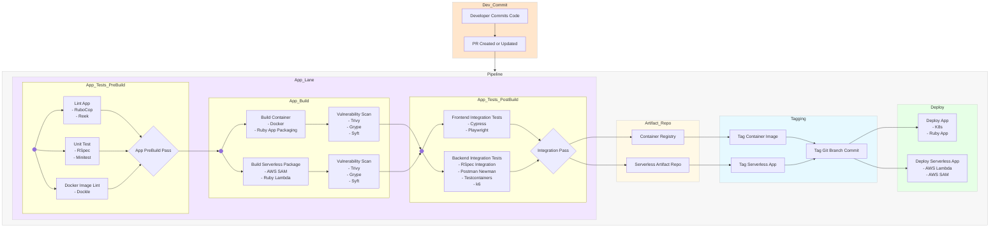

```mermaid
flowchart TD

%% ====================
%% Developer Commit & PR Stage
%% ====================
subgraph Dev_Commit
  DC1[Developer Commits Code]
  DC2[PR Created or Updated]
  DC1 --> DC2
end

%% ====================
%% Pipeline
%% ====================
DC2 --> Pipeline
subgraph Pipeline

  %% ====================
  %% App Lane
  %% ====================
  subgraph App_Lane
    direction LR
    
    %% Pre-Build Tests (parallel with junction style)
    subgraph App_Tests_PreBuild
      direction TB
      PTJ@{ shape: f-circ, label: "PreBuild Junction" }
      
      PTJ --> AT1[Lint App<br>- RuboCop<br>- Reek]
      PTJ --> AT2[Unit Test<br>- RSpec<br>- Minitest]
      PTJ --> AT3[Docker Image Lint<br>- Dockle]
      
      AT1 --> APB{App PreBuild Pass}
      AT2 --> APB
      AT3 --> APB
    end
    
    %% Build
    subgraph App_Build
      APB --> CBJ@{ shape: f-circ, label: "Build Junction" }
      CBJ --> AB2[Build Container<br>- Docker<br>- Ruby App Packaging]
      AB2 --> AB3[Vulnerability Scan<br>- Trivy<br>- Grype<br>- Syft]
      CBJ --> AB4[Build Serverless Package<br>- AWS SAM<br>- Ruby Lambda]
      AB4 --> AB5[Vulnerability Scan<br>- Trivy<br>- Grype<br>- Syft]
    end
    
    %% Post-Build Integration Tests with Junction
    subgraph App_Tests_PostBuild
      ITJ@{ shape: f-circ, label: "Integration Junction" }
      
      AB3 --> ITJ
      AB5 --> ITJ
      
      ITJ --> FIT[Frontend Integration Tests<br>- Cypress<br>- Playwright]
      ITJ --> BIT[Backend Integration Tests<br>- RSpec Integration<br>- Postman Newman<br>- Testcontainers<br>- k6]
      
      FIT --> ITP{Integration Pass}
      BIT --> ITP
    end
  end
  
  %% ====================
  %% Artifact Repo
  %% ====================
  subgraph Artifact_Repo
    AR1[Container Registry]
    AR2[Serverless Artifact Repo]
    ITP --> AR1
    ITP --> AR2
  end
  
  %% ====================
  %% Tagging
  %% ====================
  subgraph Tagging
    AR1 --> TG1[Tag Container Image]
    AR2 --> TG2[Tag Serverless App]
    TG1 --> TG4[Tag Git Branch Commit]
    TG2 --> TG4
  end
  
  %% ====================
  %% Deploy
  %% ====================
  subgraph Deploy
    TG4 --> DP1[Deploy App<br>- K8s<br>- Ruby App]
    TG4 --> DP2[Deploy Serverless App<br>- AWS Lambda<br>- AWS SAM]
  end

end

%% ====================
%% Styles
%% ====================
style Dev_Commit fill:#ffe6cc,stroke:#cccccc,stroke-width:1px
style Pipeline fill:#f7f7f7,stroke:#cccccc,stroke-width:1px
style App_Lane fill:#f2e6ff,stroke:#cccccc,stroke-width:1px
style Artifact_Repo fill:#fff9e6,stroke:#cccccc,stroke-width:1px
style Tagging fill:#e6f9ff,stroke:#cccccc,stroke-width:1px
style Deploy fill:#e6ffe6,stroke:#cccccc,stroke-width:1px


```
